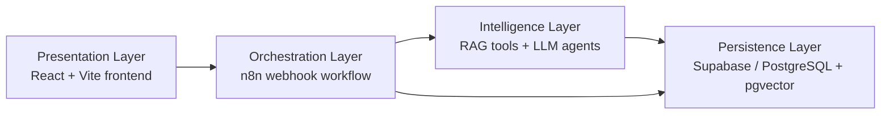

# Module InAction AI Learning Assistant

React + Vite frontend for a learning assistant demo. The app supports a normal
chat mode and a role-play mode that sends HTTP POST requests to an n8n webhook.

## Project Background

This repository contains the public-safe source code for the final MVP of
Module InAction (AI Booster), an applied AI project developed in an academic
context with Cegoc as the industry partner.

The project explores how generative AI can support active learning and skills
transfer in corporate training. Instead of delivering only static course
content, the MVP offers a conversational learning layer over course material:

- A learner can ask free-form questions about the indexed course content.
- A learner can practice a structured commercial negotiation role play.
- The system grounds its answers in retrieved course material instead of
  relying only on the language model's general knowledge.
- The workflow keeps conversational state so a role-play session can progress
  through multiple turns and produce formative feedback.

The private course material, production endpoints, credentials, and final report
PDF are not included in this public repository.

## Main Features

- Chat mode for course Q&A and guided learning prompts.
- Role-play mode for commercial negotiation practice.
- Config panel for webhook URL, optional API key, user ID, course, level,
  scenario, language, and notes.
- Local browser persistence with `localStorage`.
- Conversation export to JSON or TXT for local review.

## Learning Modes

### Free Chat Mode

The learner asks questions in natural language. The n8n backend retrieves
relevant course excerpts from the vector store and asks the LLM to answer only
from that retrieved context. If the workflow cannot find enough evidence, the
assistant should refuse or explain that the answer is not covered by the course
material.

### Role Play Mode

The learner enters a 10-turn commercial negotiation simulation. The backend
first generates a structured scenario and then evaluates each learner response
turn by turn. Feedback is formative: it is intended to help the learner improve
during practice, not to replace human assessment or certification.

## Architecture Overview

The full MVP is organized in four layers:



- Presentation: React, TypeScript, Vite, Tailwind CSS, and shadcn/ui style
  components.
- Orchestration: a single n8n webhook workflow routes requests by action, such
  as chat, start role play, or answer role play.
- Intelligence: OpenAI chat and embedding models are used through n8n nodes.
- Persistence: Supabase/PostgreSQL stores vectorized course chunks, sessions,
  role-play turns, messages, and chat memory.

The public workflow in this repository is sanitized. It preserves the structure
of the implementation but removes private credentials, workflow IDs, webhook
IDs, Google Drive file IDs, and private document references.

## Tech Stack

- React 18
- TypeScript
- Vite
- Tailwind CSS
- shadcn/ui style components
- Vitest

## Project Structure

```text
src/
  components/       Reusable UI and feature components
  hooks/            Shared React hooks
  lib/              Utility helpers
  pages/            Route-level pages
  services/         Webhook, storage, and export logic
  test/             Test setup and examples
  types/            Shared TypeScript types
workflows/
  module-inaction-ai-workflow.public.json
                    Public-safe n8n workflow export
  AUDIT.md          Sanitization summary for the n8n export
```

## Getting Started

Install dependencies:

```bash
npm install
```

Run the development server:

```bash
npm run dev
```

Build for production:

```bash
npm run build
```

Run tests:

```bash
npm run test
```

## How to Use the Demo

1. Start the frontend with `npm run dev`.
2. Open the app in the browser.
3. Open the configuration panel.
4. Paste the n8n webhook URL for your own deployed workflow.
5. Add an API key only if your webhook expects an `x-api-key` header.
6. Choose Chat mode to ask course questions, or Role Play mode to start the
   negotiation simulation.

Without a configured webhook, the frontend can still be inspected locally, but
chat and role-play requests will not produce real backend responses.

## Webhook Configuration

The app does not commit a real n8n webhook URL or credentials. Configure the
webhook from the in-app configuration panel.

For local development only, you can also copy `.env.example` to `.env.local`
and set:

```bash
VITE_N8N_WEBHOOK_URL=
```

Important: Vite exposes every `VITE_*` variable to the browser bundle. Do not
store private API keys, passwords, OAuth tokens, or confidential credentials in
frontend environment variables. If the webhook needs private authentication,
put the secret behind a backend proxy or keep it only inside n8n/server-side
configuration.

## n8n Workflow

This repository includes a cleaned public copy of the workflow:

```text
workflows/module-inaction-ai-workflow.public.json
```

The original n8n export was reviewed before adding this public copy. The public
workflow has been sanitized as follows:

- Removed all n8n credential references, including credential names and IDs.
- Removed workflow-level `id`, `versionId`, `meta.instanceId`, and `pinData`.
- Removed the webhook node `webhookId`.
- Replaced the Google Drive file ID and direct Google Drive file URL with
  placeholders.
- Replaced specific course-material file names with generic placeholders.
- Checked for common token patterns such as OpenAI keys, GitHub tokens, AWS
  access keys, Google API keys, Slack tokens, npm tokens, JWT-like tokens, and
  private key blocks; no matches were detected in the reviewed export.

After importing the workflow into n8n, configure fresh credentials manually for:

- OpenAI
- Supabase
- Postgres
- Google Drive

Then update any placeholder document IDs, webhook paths, database tables, and
environment-specific values for your deployment.

The detailed sanitization report is in:

```text
workflows/AUDIT.md
```

If the workflow is exported from n8n again, clean the new JSON before committing
it:

- Remove credentials, credential IDs, OAuth tokens, cookies, API keys, and
  passwords.
- Remove private webhook URLs if the endpoint should not be public.
- Remove execution data, sample user messages, binary data, and personal data.
- Replace organization-private URLs, file paths, and document names with
  placeholders when they are not necessary to understand the workflow.
- Do not include files covered by NDA or partner confidentiality restrictions.

Recommended public placeholders:

```text
https://your-n8n-instance.example/webhook/your-webhook
YOUR_API_KEY
YOUR_CREDENTIAL_ID
```

## Data, Privacy, and Compliance Notes

- Do not commit private course PDFs, user conversations, exports, database
  dumps, or partner-internal documents.
- Do not expose production webhook URLs, API keys, OAuth credentials, database
  passwords, or Google Drive file IDs in frontend code.
- If the workflow is used for training evaluation, keep human oversight and
  review the relevant GDPR/RGPD and EU AI Act requirements before production
  use.
- Automatic scores should be treated as formative feedback unless the
  organization has completed the necessary governance and validation process.

## Current Limitations

- The public repository does not include private course material or live
  credentials, so the workflow must be configured after import.
- The role-play workflow should include input pre-filtering before evaluator
  calls in production, especially for non-natural inputs such as raw JSON,
  binary-like text, or Base64-like strings.
- End-to-end validation requires a configured n8n instance, Supabase/Postgres
  database, vector index, and frontend webhook URL.

## Public Release Security Checklist

Before publishing this repository:

- Confirm there are no `.env`, `.env.local`, `.env.production`, or local config
  files in the commit.
- Confirm the source code does not include API keys, passwords, tokens, private
  keys, or live production webhooks.
- Confirm exported conversations such as `cegos-fase3-*.json` and
  `cegos-fase3-*.txt` are not committed.
- Confirm any n8n workflow export has credentials and execution data removed.
- Confirm no partner documents, internal company files, personal data, or NDA
  material are included.
- If a secret was ever committed, rotate or revoke it before making the
  repository public.

## Current Frontend Audit Summary

This repository has been prepared for public repository use:

- No hard-coded API key, password, token, JWT, private key, GitHub token, OpenAI
  key, AWS key, or npm token was found in the frontend or sanitized workflow
  scan.
- The previous hard-coded default webhook URL was removed from source code.
- The optional `apiKey` field remains user-provided at runtime and defaults to
  an empty string.
- The n8n workflow was added only as a sanitized public export.
- `.gitignore` excludes local env files, likely credential files, n8n local
  folders, and generated conversation exports.

## License

Add the project license here before publishing if required by the course or the
partner organization.
